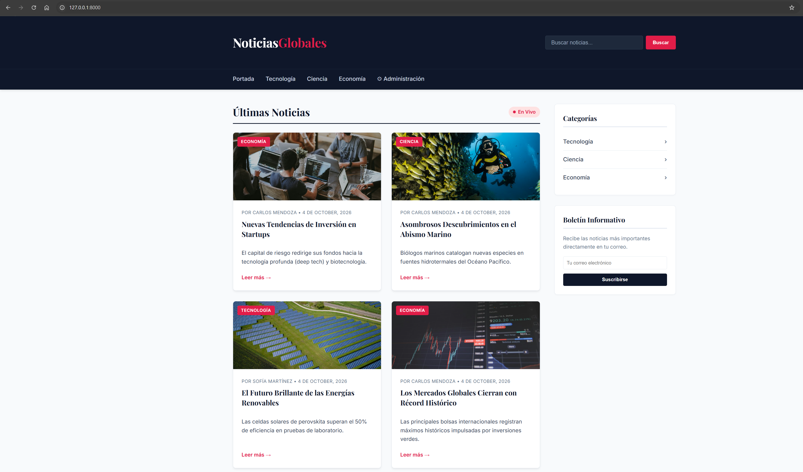
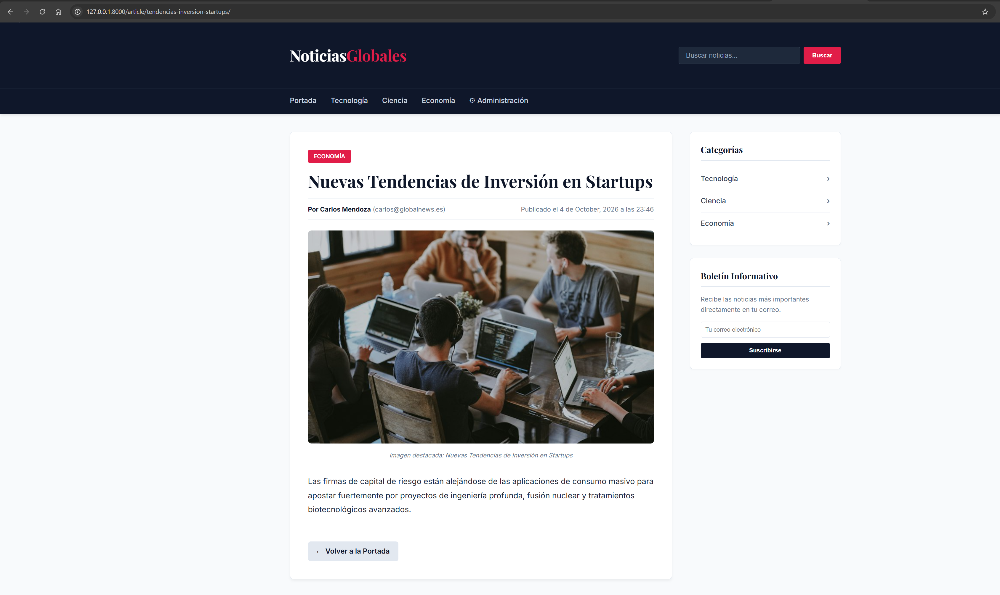
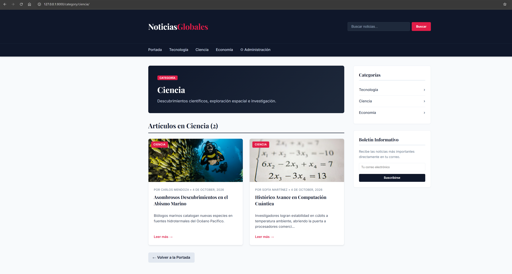
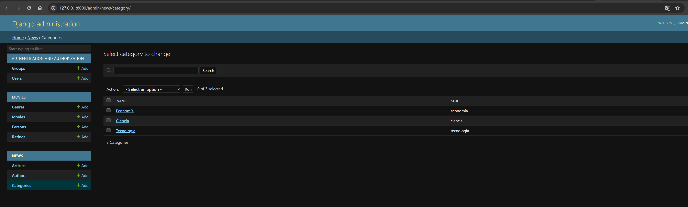
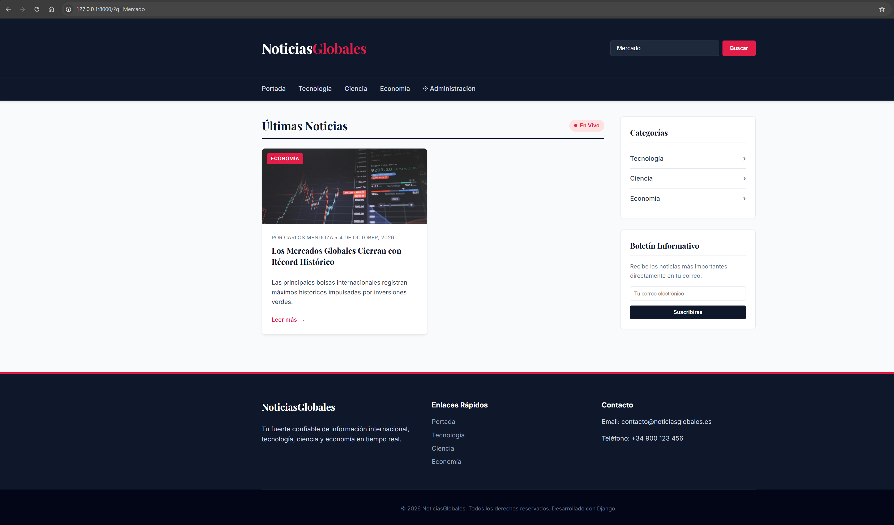

# Lab06: Portal de Noticias y Motor de Plantillas en Django

Este repositorio contiene el desarrollo del proyecto **Lab 06** en **Django**, enfocado en la implementación de un motor de plantillas avanzado con herencia y fragmentos reutilizables, visualización de datos de modelos mediante variables, etiquetas de control y filtros, gestión integral de contenidos desde el panel de administración personalizado, y cumplimiento estricto de las normas PEP 8 y estándares de desarrollo.

---

## 🚀 Descripción General del Proyecto

El sistema es un **Portal de Noticias** robusto construido en Django. Permite a los usuarios explorar noticias de actualidad divididas en categorías (*Tecnología*, *Ciencia*, *Economía*), ver detalles completos de cada artículo con su respectiva imagen destacada (*ImageField*), autor y fecha, y realizar búsquedas en tiempo real. 

### 🔗 Enlaces de Acceso Local (Desarrollo)
Una vez ejecutado el servidor (`python manage.py runserver`), puedes acceder a:
- **Portada Principal (Frontend):** [http://127.0.0.1:8000/](http://127.0.0.1:8000/)
- **Panel de Administración (Django Admin):** [http://127.0.0.1:8000/admin/](http://127.0.0.1:8000/admin/) 
  - *Superusuario:* `admin` / `admin123`

---

## 📋 Resumen de Implementación 

1. **Estructura y Dependencias:** Creación del proyecto, instalación de **Pillow** para imágenes y registro de la aplicación `news` en `INSTALLED_APPS`.
2. **Configuración de Rutas y Medios:** Configuración en `settings.py` de directorios de plantillas (`DIRS`), archivos estáticos (`STATICFILES_DIRS`) y multimedia (`MEDIA_URL` / `MEDIA_ROOT`), sirviendo los medios en desarrollo desde `config/urls.py`.
3. **Modelos de Datos:** Declaración de los modelos `Author`, `Category` y `Article` en singular, con clave foránea, `ImageField` para imágenes destacadas, fecha de publicación y relaciones de integridad.
4. **Plantilla Base (`base.html`):** Estructura HTML común del portal con bloques reutilizables para título (`title`), contenido (`content`) y barra lateral (`sidebar`).
5. **Fragmento Reutilizable (`_article_card.html`):** Componente modular de tarjeta de noticia incluido en la portada y en los listados por categoría.
6. **Plantilla de Portada (`home.html`):** Recorrido de noticias con bucles ``, manejo de resultados vacíos con ``, y aplicación de filtros de fecha (`|date`) y recorte de texto (`|truncatechars`).
7. **Plantilla de Detalle (`article_detail.html`):** Visualización completa de la noticia con su imagen destacada, autor, categorías, contenido enriquecido y el filtro `|safe`.
8. **Listado por Categoría (`category_list.html`):** Filtrado de artículos por categoría reutilizando el fragmento de tarjeta.
9. **Enrutamiento y Etiquetas URL:** Declaración de rutas con nombres propios (`app_name = 'news'`) y enlace dinámico mediante `` sin direcciones escritas a mano.
10. **Archivos Estáticos y Estilos:** Carga de estilos con `` y diseño responsivo moderno (*NoticiasGlobales*).
11. **Administrador Personalizado:** Configuración avanzada de `admin.py` mediante `list_display`, `list_filter` y `search_fields` para `Author`, `Category` y `Article`, con 6 noticias pre-cargadas en 3 categorías.
12. **Escapado Automático:** Validación del mecanismo de seguridad de Django contra ataques XSS y demostración del uso del filtro `|safe` para renderizar marcado HTML de forma controlada.
13. **Repositorio y Entregable:** Control de versiones estructurado en **6 commits atómicos** y subido a la rama `main` del repositorio oficial.

---

## 📐 Modelos del Sistema

- **`Author` (Autor)**: Nombre, correo electrónico y biografía del redactor.
- **`Category` (Categoría)**: Nombre, slug único y descripción temática.
- **`Article` (Artículo/Noticia)**: Título, slug, autor (`ForeignKey`), categoría (`ForeignKey`), resumen, contenido completo, imagen destacada (`ImageField`), fecha de publicación y estado de publicación.

---

## 🤖 Agentes Utilizados

Durante el desarrollo de este laboratorio, se utilizaron subagentes especializados para la planificación, implementación y auditoría:

- **`django-architect`**: Especializado en la arquitectura Django, creación de la app `news`, modelos relacionales, migraciones y configuración de archivos estáticos y multimedia.
- **`django-template-expert`**: Especializado en el motor de plantillas, herencia (`base.html`), fragmentos (`_article_card.html`), etiquetas de control, filtros, enrutamiento `` y pruebas de escapado automático.
- **`qa-verifier`**: Especializado en la auditoría de calidad contra los 13 pasos del procedimiento y la rúbrica de calificación de 20 puntos.

---

## 📸 Capturas y Evidencias del Proyecto

1. **Portada Principal del Portal**:
   * *Descripción:* Vista principal del portal web mostrando la cuadrícula de noticias con sus imágenes ilustrativas, categorías y barra de navegación.
   * 

2. **Detalle del Artículo**:
   * *Descripción:* Vista individual de la noticia destacando la imagen de portada, metadatos del autor y contenido enriquecido.
   * 

3. **Listado por Categoría**:
   * *Descripción:* Filtrado dinámico de noticias agrupadas por categoría temática.
   * 

4. **Panel de Administración Personalizado**:
   * *Descripción:* Interfaz de Django Admin para la gestión de Autores, Categorías y Artículos con `list_display`, `list_filter` y `search_fields`.
   * 

5. **Búsqueda en Tiempo Real**:
   * *Descripción:* Resultados de búsqueda filtrados instantáneamente mediante consultas ORM.
   * 

